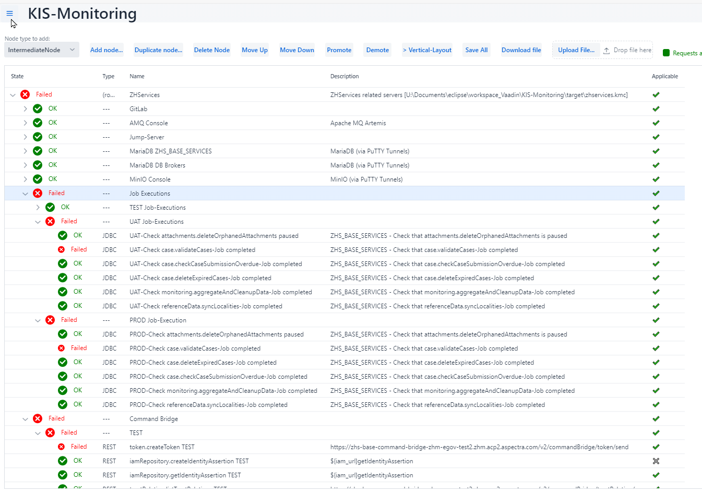
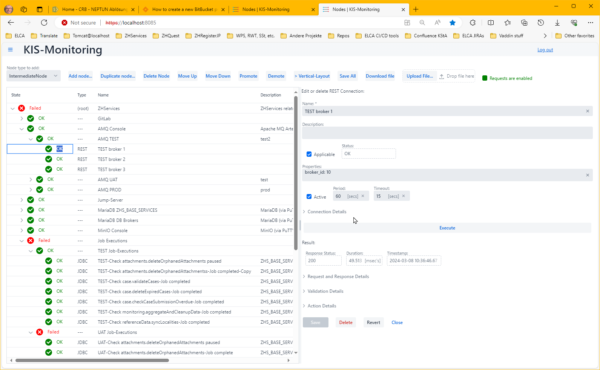
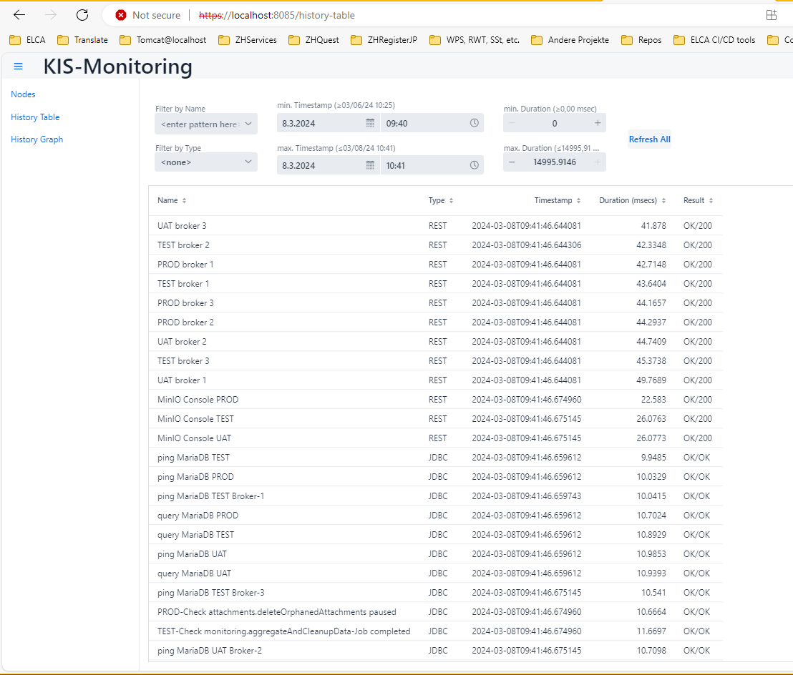
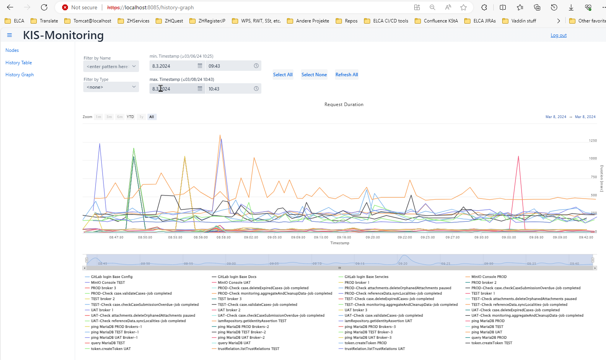
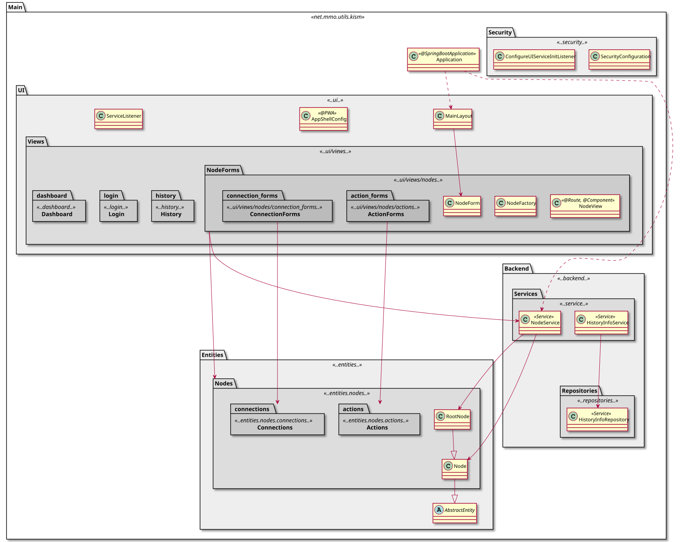
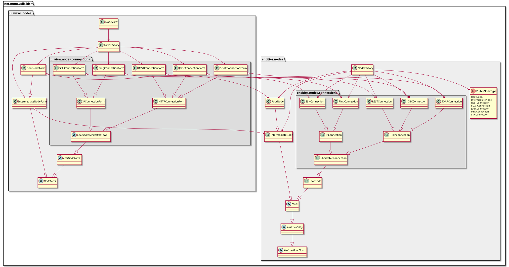
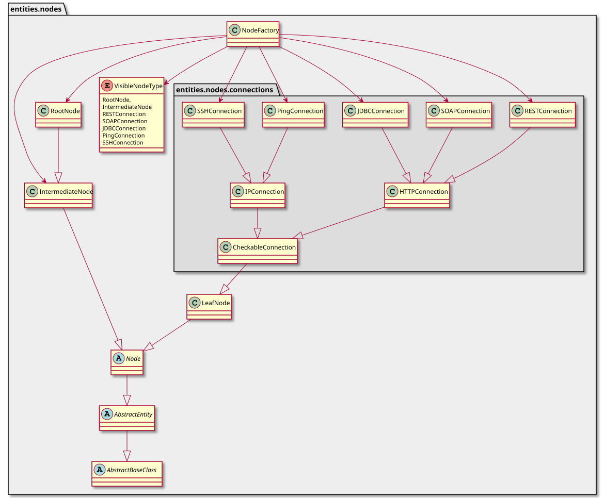

# KIS-Monitoring

KISMON (for "Keep-It-Simple MONitoring") is a tool whose goal it is to monitor the liveness and 
responsiveness of application- and DB-servers and of entire collections or "environments" of such
components which are required to provide a "service". This can be e.g. a compound of a DB, a Proxy-server 
or load-balancer (if applicable), one or more Web(Application)Server(s) running an application 
plus e.g. one or more Mock-Server(s) (as is often applicable for test environments).

It provides a tree-like overview of your system like so:



# Table of Contents

[[_TOC_]]

# Introduction

## Node-Hierarchies and States

Components form a tree and can be organized and grouped in subtrees. The requests used to probe for the 
corresponding element's conditions can be defined on "leaf-nodes" in that tree. 
For each such "leaf node" conditions can be defined what response is to be considered as "OK". If that 
condition is *not* met it is considered as "Failed".

*Intermediate Nodes* summarize the results of their respective children. That "summarization" can be 
configured, i.e. there are several conditions to choose from what combination of children states is to 
be considered as *OK*, *Degraded* or *Failed* for a parent node. 
Such conditions can be "All children must be OK", "At maximum one child is allowed to be not OK" (this 
can be used in redundant setups where ONE failing component is tolerable but degrades the stability), 
"at most one child must be OK" (this condition can be used to verify that exactly one and only one child 
is active at a time, e.g. in fail-over setups), etc. 
States "bubble up", i.e. on the next hierarchy level the next summarization of children states is applied 
etc. all the way up to the *Root Node*.

With such a setup it is easy to spot which environments or which elements of a larger setup work 
and which don't. This may not provide the immediate root cause but it helps greatly at locating 
the sub-component that may be the reason why some application or an environment does not work.

Remark: there may be more than one *Root Node* (not shown here)! Each *Root Node* with all its 
children corresponds to one configuration file (see further down on config files).
KISMON can load multiple configurations and monitor more than one hierarchy at once.  

## Requests and Request-Types

Request-types that are supported by KISMON are *REST*- and *SOAP*-requests, *JDBC*-requests 
(i.e. DB queries), *PING* (does ICMP-pings testing reachability and responsiveness of a system) 
and *SSH*, the latter meaning a "command-line" that is executed after logging into the target system using
an SSH connection. 
This command-line can be any shell command line like a single command, a script name or a compound of 
several concatenated (piped) commands.



Requests are specified using a "form" which opens at the right when double-clicking on the first part 
(the icon) of the corresponding line in the tree. Double clicking again hides the form. 
One can move the slider/divider between the left-hand tree view and the right-hand "form" to adjust how 
much screen space is used for which part.
The forms contain a generic section (with name, a description/comment, and a few fields defining if and 
how frequent that request is to be executed and whether it is to be taken into account when calculating 
the parent node status).
Below that section are a couple of "accordeons", i.e. sections that can be opened (expanded) and closed 
(collapsed) describing the "connection details", the "response details", "validation details" and 
"action details". The content of these sections varies depending on the request *type*. 

* The response details of *REST*- and *SOAP*-commands are the resulting responses from the connected 
service.
* The response of a *JDBC*-command is the resulting DB-output, i.e. a table containing the query results 
ordered by column.
* The response of a *PING*-command is the result of a ping-command as executed on a command-line (KISMON 
extracts the response time from that result).
* The response of an *SSH*-command the resulting output of the command executed on the logged-in user's 
shell.

### Nodes View

The main view of KISMON is clearly the nodes view as shown in the screenshots above. 
It shows the status of the last "poll" and the status hierarchy is updated after each update 
(I call this the "bubbling-up" of states).

The right-hand side forms allows to inspect details for each node, esp. to inspect the results
from the last response received (or not received in which case one can see the reason and/or 
the error message).

### History Data

Results of all requests (i.e. the node name, the timestamp of each request, the resulting status and 
response times) are saved to a DB. 
By default that is a simple in-memory DB (H2) but one could also specify a different one (in the 
*application.properties* file) in case one would want to export and/or use the data further, 
e.g. for some statistics).

#### History Data Table View

There is a *tabular* history view that allows to browse the history data with filters to narrow down the 
list to specific host(s) and/or time spans. With that one can e.g. inspect whether a system was up and 
running or not or whether it experienced some slow-down during a specific period, etc.



#### History Data Graphical View

There is also a *graphical* history view whose purpose is to provide a graphical visualization of the 
response times. However, that view is still in a very infant state (i.e. still experimental and unstable). 
When its filter is not very narrow (i.e. yielding large amounts of data to display) the backend calls 
of this view occasionally hang or even crash the application, so this feature is definitely *not* 
"production-ready", yet. I suggest to ignore it for now. 

The use of that view also requires a special license since the Graph-widget that is used for this view 
is not part of the free Vaadin "core", so your application - when calling up this view - may or may not 
crash or hang in the license verification process.



## Configuring the Application

### Configuration via Forms

The individual request types and parameters (for leaf nodes) and the summarization rules 
(for intermediate nodes) are configured via different "forms". These forms contain parts that are always 
visible and parts that are initially hidden in collapsed "accordions", i.e. parts that can be "expanded"
or "unfolded" to see their details.

#### The generic fields at the top (always visible):

The generic fields at the top of the forms are the same for all node types. These are 
* the *name* of each "node" (which must be unique in the entire tree). 
Note, that there is *no* property-replacement done for this field.
* an arbitrary *comment* or description. This field is for human consumption only and not used by the 
application. There is also *no* property-replacement done for this field.
* a toggle whether the node is *applicable*. This flag steers, whether the parent includes or ignores 
that node's result for it "summarization". If the toggle is "off", the node can still be executed 
(or even be "active", i.e. regularly sending requests) but their result is displayed only and not 
otherwise considered for the summarizing and "bubbling-up" of results.
This allows e.g. to prevent a subtree to continuously be shown as failed or degraded if it is known that 
some (sub)system is down for an extended period. During such a period one can simply un-check the 
"Applicable"-checkbox (instead of e.g. having to delete and later regenerate that entry).
* a toggle whether the node is *active* (i.e. whether requests are sent regularly). 
Next to that toggle are two numeric fields that allow to specify the period of the requests (in seconds) 
the timeout (also in seconds), i.e. the time after which a response is considered as degraded. 
If there is no response at all the request is considered as failed (one can specify further conditions 
as to when a request is "OK" or "Failed" - see further down).
There also is a *properties* field that allows to specify *name:value*-pairs which can be used as 
placeholders in most alphanumeric entry fields of *this* node or any of its children-nodes, i.e. properties 
are inherited from a node's parent (and grand-parent, grand-grand-parent, etc.).

#### Connection Details (accordion 1)

These are collected in an "Accordion", i.e. a part of a form that is expandable and collapsible by 
clicking onto the accordeon's header to the right of the "twisty" (triangle).

Each node- (i.e. request)-type has its specific *Connection Details* fields:

##### REST-Requests

This type derives from *HTTP_Connection*, i.e. if offers the connection configuration details *URL*, 
*user-id* and *password*. These fields can contain placeholders.
The latter two fields can be included as a basic authentication header in the initial request (when the 
*include Basic Authentication Header*-checkbox is checked.)

Further connection details are the HTTP-method (supported are *GET*, *PUT*, *POST*, *DELETE*, *HEAD*, 
*CONNECT*, *OPTIONS*, *TRACE* and *PATH* albeit in real life probably only the first three are useful).

There is a field "Request Headers" which allows to add HTTP-headers using the format 
<headername>: <headervalue>. Please refer to the applicable 
[HTTP-related RFCs](https://de.wikipedia.org/wiki/Hypertext_Transfer_Protocol)
regarding details to these HTTP header fields, i.e. their names, acceptable values and applicable formats.
This field also supports placeholders.

For methods that allow to send a "payload" (or content), i.e. PUT and POST, there is also a corresponding 
entry-field for such payuloads provided. This field also supports placeholders.

##### SOAP-Requests

This type also derives from *HTTP_Connection* but supports POST-requests only (as SOAP does) - the 
HTTP-method field is thus hidden.
Besides all the fields provides by REST-POST requests there also is *SOAP-action* field allowing to 
enter the value of the likely-named HTTP-header field.

##### JDBC-Requests

This type also derives from *HTTP_Connection*. It does not have an HTTP-method selector, instead it 
provides two fields: one for the JDBC driver class-name and a second for the SQL-query that is to be 
regularly sent to the DB. The latter must *not* contain a trailing ';'!
For simple "DB-pings" (i.e. tests whether a DB server is up and responding at all at the specified port) 
it is typically enough to just send the ubiquitous `select * from dual`-request (which yields the 
response `OK`). 
If one wants to check whether a DB is working and contains and provides application specific data 
then some application specific non-data-modifying query should be used (and its response validated to 
contain the expected answer).

##### PING-Requests

This type derives from IP_Connection (i.e. one specifies no protocol, only an IP host-name or -address).
Note that - since Java does not support to send ICMP-requests and TCP-/UDP-echo (on port 7 / RFC 862) 
is only very seldom supported - these requests actually fork a system shell 
(*cmd* on Windows, *bash* on \*ix) to use the system's command "ping" to do the job. 

##### SSH-Requests

This type also derives from IP_Connection and opens an SSH connection (default: on port 22) to the 
target host, logs in (using the values in *authentication method* , *user name*  and *password*).
It can optionally verify the received server fingerprint and then sends out an arbitrary command 
suitable for the shell that is started for that SSH-user (and permitted for that user).
The command can be any shell command, the name of (an) executable(s) and/or any combination of commands 
concatenated using the pipe-symbol. 
E.g. to continuously monitor the used-up disk space on the volume `/dev/sda2` of one of our server 
machines we used the command 
`df -h |  grep -m 1 \"/dev/sda2\" |  awk '{ print $5 }'  | sed -e s/\\\\%//g`,
i.e. we got the list of the spaces used-up on all disk-drives of the machine, "grep-ed" for the one that 
we were interested in, "awk-ed" the column containing the diskspace used as percentage and removed the 
trailing %-sign. The response, i.e. the resulting number from the above command, was then validated and 
flagged as *OK* when below 90(%), *Degraded* when between 90(%) and 95(%) and *Failed* when above 95(%) 
to alert us when the disk was about to run full.

##### Intermediate Nodes

*Intermediate nodes* summarize the results of their children-nodes based on "Children condition":
Such conditions are:

*ALL OK* i.e. ALL children-nodes must be OK for an *OK* of that intermediate node, otherwise that node is 
considered as *Failed*. This condition is useful to make sure that ALL children nodes are up and OK.

*DEGRADED ON NOT ALL OK* means: the intermediate node is *OK* if ALL children are *OK*, 
*DEGRADED* if at most  *one*  child is *Degraded* or *Failed* and *Failed* otherwise. This condition is 
useful if e.g. a pool of devices or services provides some redundancy and allows for *one* member 
(but not more) to fail or be degraded to remain operational.

*ANY NOT FAILED* means: an intermediate node is considered as *OK* (or *Degraded*) if at least one child 
is *OK* (or *Degraded*). If all children are *Failed*, i.e. there is no child that is neither *OK* nor 
*DEGRADED* then the intermediate node is considered *Failed*. This condition can be used if a single *OK* 
or *Degraded* node is enough for an *OK* or *Degraded* status of the collection or pool.

*EXACTLY ONE* is a condition that is meant to check for the availability of fail-over pairs, i.e. pairs 
of servers or services where one is active while the other is in "stand-by" or "fail-over mode". 
Only one of the two must be and is allowed to be up, i.e. *OK*, the other two situations (where none or 
both are active) are *not* allowed and thus considered as *Failed*.

#### Result (always visible for Leaf-nodes)

Below the *Excute*-button (which is also always visible and allows to trigger a request manually) there 
is a section that displays the request's response status, the timestamp of the sent request as well as 
the duration until the response was received.

#### Request and Response Details (accordion 2 for Leaf-nodes)

The second accordeon contains no user-fillable fields. Rather it allows to display and verify the header 
and payload of the *outgoing* message **exactly** as sent to the target system as well as - if the system 
responded - the header and payload of the *received* response.

Displaying the outgoing *Resulting Request Headers:* and *Resulting Request Body:* allows to verify that 
e.g. the resolution of placeholders yielded the expected result. Here one can also see the created 
Basic Authentication Header (if the corresponding checkbox was checked) and the SOAP-Action that was 
included in the request (if any was entered into that special field).

#### Validation Details (accordion 3 for Leaf-nodes)

This form part allows to specify additional conditions that must be fulfilled to consider a received response 
as *OK* (rather than *Failed*.
It is only displayed for HTTP- ()i.e. *REST*- and *SOAP*-), *JDBC*- and *SSH*-connections 
(i.e. not for *Ping*-connections) and the detail fields that allow to specify these additional 
conditions are only shown if the *Check results*-checkbox is checked. 
If it is *not* checked than the only condition considered is the request-timeout (in seconds 
- as given in the top section of the form).
If the checkbox *is* checked then additional fields are displayed:

* For HTTP connections the acceptable HTTP response code(s) can be specified. This is a comma-separated 
list of numerical values (3 digits each) if more than one return code is acceptable.
* The second field specifies a *condition* that is to be fulfilled by the payload of the received result 
(or the DB response in case of JDBC requests).

These conditions can be *string*-operations ("is-equal", "starts-with", "ends-with", "contains", or 
"matches" a regular expression, most in variants with or without ignoring the case) or 
*numerical* operations ("greater", "less", "within-a-range", "outside-a-range", "range-ascending", 
"range-descending"). 
The last four conditions have *two* numeric arguments. The "range-ascending" and "range-descending", 
respectively, can be used to not only decide on *OK* or *Failed* but to yield *OK*, *Degraded* or 
*Failed* depending on whether a value is lower or higher, resp., than the first argument, 
between the two argument values or above or below, resp., the second argument.

#### Action Details (accordion 4 for Leaf-nodes, 1 for Intermediate nodes)

The last accordion allows to specify an action to be taken if the state of a node changes. 
##### Actions can be:

* emit a log message - this goes to the application's log and no further arguments are required.
* send an email - selecting this action causes additional fields to be displayed that allow to define 
the emails' sender, the subject and the message's content.

###### Special Email Action Placeholders

For this action additional "properties" or "placeholders" are defined that may be used as part 
of the subject- or the content-field:

| Placeholder name | Placeholder value |
|------------------|-------------------|
| $\{NodeName\} | the name of the node |
| $\{NodeStatusTo\} | the new status (\*) |
| $\{NodeStatusFrom\} | the previous status (\*) |
| $\{NodeDescription\} | the comment or description of the node |
| $\{SameStatusCounter\} | the number of requests that yielded the same status since the last status change | 
| $\{ThresholdForFailed\} | the threshold value for a change to *Failed* |
| $\{ThresholdForDegraded\} | the threshold value for a change to *Degraded* |
| $\{ThresholdForOK\} | the threshold value for a change to *OK* |
| $\{ApplicableThreshold\} | the threshold value that was applied to trigger the action  (i.e. one of the three above depending on the current status) | 
| $\{ApplicableTimespan\} | the applicable threshold multiplied with the request period yielding the time (in seconds) since the last status change | 
| $\{TargetAddress\} | the IP address of the system that the request was sent to | 


(\*) during manually triggered execution of the action these values are unknown and hence a replacement
value of "---" is displayed.
##### Planned, future actions are:

* run a local command or script (Note: "local" here means: on the server running the application - 
this might but typically will not be the same system running the user's browser).
* run a remote command or script on another system (an arbitrary system logged into using SSH).

##### Threshold values:

The execution of actions is "delayed" by threshold values (i.e. the action is not triggered 
immediately by a state transition but only after certain number of requests have yielded the same state). 
The purpose of these threshold values is to avoid spamming a user (typically the system's administrator) 
with too many alerts. 
If, say, a system is rebooted every midnight, then one check may yield "no response". However, a minute 
or two later the system will (presumably) be up again and responding fine. 
This is then considered as "OK" and will not trigger the defined action (e.g. an alert-email to its admin). 

Only if the system is down and not responding for, say, 5 subsequent checks, then the action is triggered 
and an alert is sent out reporting that the system is in state "Failed" since \<Threshold for Failed\> 
checks.
If the system then is later up and responding again for a certain number (\<Threshold for OK\>) of 
subsequent checks then another action is triggered reporting that the system is now OK again.

##### Same state counter & Reset status counter buttons

This field simply displays how often the same state was encountered, i.e. how many requests have yielded
the same status. The Reset-button allows to reset that value.

##### Trigger action manually manually

This button allows to trigger an action manually. This proved helpful while defining and testing an action, 
especially while defining recipient(s), subject and content of alert-emails to be sent out.

### KISMON configuration via a JSON Config File

KISMON saves its configurations in JSON files (default extension is ".kmc" for 
"**k**is**m**on **c**onfiguration").
This file is a 1:1 serialization of the internal tree structure that steers the operation of the 
application
(remark: this fact is also the reason why some nodes need a 'className="..."' field because the actual 
(sub)class to be instantiated needs to be signaled to the de-serialization and can not be derived from 
the context).
The fields of each object correspond mostly directly to the form-fields, i.e. it should be relatively 
easy and straight forward to understand what the misc. fields and values mean.

For larger changes or modifications (like duplicating a large number of nodes or splitting or merging two 
config files) it may be easier and quicker to simply edit the .kmc file and reload that into the 
application afterwards instead of editing and redefining everything via the GUI.
Of course maintaining the correct JSON hierarchy and bracketing while doing so may pose a bit of a 
challenge, but it is definitely feasible (I have done that numerous times...).

There is one noteworthy exception - namely a feature for which no GUI exists (yet) and which can thus 
*only* be configured via the config file:

#### Client Certificate Handling

At the very end of the config JSON file there can be an optional section:
```
	...
	"certificateHandling" : {
		"descriptors" : [ {
			"hostPattern" : "Wtest.example.com",
			"keyAndCertFileName" : "D:/Projects/Certificates/TEST/client_test.p12",
			"keyAndCertFileType" : "PKCS12",
			"keyAndCertFilePwd" : "changeit",
			"keyAndCertKeyPwd" : "changeit"
		}, {
		...
		} ]
	}
}
```

This feature allows to configure specific TLS client certificates to be used when accessing (a) specific 
system, something that was needed for one of our test systems where the access to some special features 
required that the SSH client does not present its own "normal" TLS certificate when accessing the service 
but a specific client certificate that is known to the server.
This feature is very similar to the same feature as provided in the widely used 
[PostMan](https://www.postman.com/) - available as stand-alone application and as browser-extension). 

*hostPattern* specifies the host's name for which the setting is to be applied 
(Note that in spite the name wildcards or patterns are not (yet) supported. 
I plan to implement "patterns" in a later version but right now the name has to be *exactly* the 
actual target's FQDN (fully qualified domain name)).
The other four fields specify the keystore containing the certificate to be used when connecting to that 
host and the parameters required to access it. Their names should hopefully be self-explanatory.

## Running the Application

### Running on the command line:

The application is provided as executable .jar file. One can thus simply start is via:
```
set KISMON_JAR=kis-monitoring-1.1-SNAPSHOT.jar
"%JAVA_HOME%\bin\java" -cp . -jar "%KISMON_JAR%"
```
or
```
KISMON_JAR=kis-monitoring-1.1-SNAPSHOT.jar
"$JAVA_HOME\bin\java" -cp . -jar "$KISMON_JAR"
```

The application expects an `application.properties`-file in the same directory.
Everything else like the port to listen to, the config file to use, 
the predefined user-name(s) and password(s), etc. etc., are all defined via that file.

The provided scripts to build and execute the application assume that you build the application locally 
into the project's `target`-directory and that the application is then started from there. It thus also 
copies the mentioned `application.properties`-file (plus a few other files) to that directory before 
starting up the application via the command given above.

### Running from an IDE:

There are two ways to run the application:  using `mvn spring-boot:run` or by running the *Application* 
class directly from your IDE.

You can use any IDE of your preference, but Vaadin suggests Eclipse or IntelliJ IDEA.
Below are the configuration details to start the project using a `spring-boot:run` command. 
Both, Eclipse and IntelliJ IDEA, are covered.

#### Eclipse

- Right click on a project folder and select `Run As` --> `Maven build..` . 
After that a configuration window is opened.
- In the window set the value of the **Goals** field to `spring-boot:run` 
- You can optionally select `Skip tests` checkbox
- All the other settings can be left to default

Once configurations are set clicking `Run` will start the application

#### IntelliJ IDEA

- On the right side of the window, select Maven --> Plugins--> `spring-boot` --> `spring-boot:run` goal
- Optionally, you can disable tests by clicking on a `Skip Tests mode` blue button.

Clicking on the green run button will start the application.

After the application has started, you can view your it at [http://localhost:8085/](http://localhost:8085/) in your browser.

If you want to run the application locally in the production mode, use `spring-boot:run -Pproduction` 
command instead.

## Project overview

The project follows 
[Maven's standard directory layout structure](https://maven.apache.org/guides/introduction/introduction-to-the-standard-directory-layout.html):
- Under the `srs/main/java` the Application sources are located:
-- `Application.java` is a runnable Java application class and a starting point
-- `MainView.java` is a default view and entry point of the application
- `src/main/resources` contains configuration files and static resources, most notably the 
 `application.properties`-file which is used to configure the application for your environment.
- Under the `srs/test` the test files are located
- The `frontend` directory in the root folder contains client-side dependencies and resource files
-- All CSS styles used by the application are located under the root directory `frontend/styles`
-- Templates would be stored under the `frontend/src`


## Notes

If you run the application from a maven command line, remember to prepend a `mvn` to the command.

## Implementation

KISMON is based on Vaadin [Vaadin](https://vaadin.com/), a Graphik library that originally had its roots 
in [GWT (Google Web Toolkit)](https://www.gwtproject.org/) but has since left this ancestry behind 
(since v8+, we are now at v23) and is now working completely without any GWT legacy. 
The current version I would describe as "GWT done right".
The concept still follows the GWT approach that developers can write *the entire* WebApplication in Java 
and the client code gets automatically translated to JavaScript-code which is then shipped to the user's 
browser and is executed there.
The modern Vaadin uses very thin Java wrappers around WebComponents, i.e. the standard approach to 
communicate with modern WebBrowsers and JavaScript components. When using the default widgets the 
developer does not have to deal with such wrappers since Vaadin comes with an big library of basic 
widgets but also with more complex ones like tables and tree views and entire graphic views. 
For KISMON I did not have to deal with a single line of JavaScript. 
The appearance of these widget can be controlled to a large extent using CSS (style sheets). With these 
one can influence the appearance of a UI without having to modify much in the source code.
 
Vaadin also comes with very convenient default classes for application and security configuration and - a 
real highlight of Vaadin - very powerful mappers which populate form fields with corresponding POJO values 
and vice-versa.
With these the mappings updates flow in both directions (i.e. the form is updated when the POJO-value 
changes and the POJO gets updated, when a user modifies a field). These mappers also support format 
conversions and validations of a Java class's field and are really very convenient to use.

### More Information on Vaadin

- Vaadin Basics [https://vaadin.com/docs](https://vaadin.com/docs)
- More components at [https://vaadin.com/components](https://vaadin.com/components) and 
[https://vaadin.com/directory](https://vaadin.com/directory)
- Download this and other examples at [https://vaadin.com/start](https://vaadin.com/start)
- Using Vaadin and Spring [https://vaadin.com/docs/v14/flow/spring/tutorial-spring-basic.html](https://vaadin.com/docs/v14/flow/spring/tutorial-spring-basic.html) article
- Join discussion and ask a question at [https://vaadin.com/forum](https://vaadin.com/forum)

## Program Internals

### Class-structure

The main overview shows the split into the UI part, the entities, the "backend" (file-IO, DB-access, ...)
and a few utility classes (e.g. for HTTP-security config, etc.).
At program startup the backend loads one or more configuration files and starts the "monitoring engine".
This part is completely independent and agnostic of the front-end/GUI and can also run completely without 
any UI. The idea is of course that this can and will run most of the time without anyone looking at it.

When a user's browser connects a new session is created and with it a GUI for that session.
The GUI communicates with the entities, i.e. it visualizes their status and also allows to modify 
certain settings.
While a session is active the entities and the UI(s) are "synchronized", i.e. not only are 
UI-(config)-changes written to the entities but the UI is updated live with the last response and when attributes or status change.







 classes")

### Tooling

#### Automatically convert the REAMD.md file to an HTML help page

To automatically convert the Github REAMD.md file to an HTML help page, run the 
`ConvertREADME2HTML.cmd` script.

Before doing so, append the following at the very end of `package.json` (Note the comma `,` - 
here highlighted as `**,**` - that you have to append to the line before the last closing `}` to 
achieve valid JSON syntax):

```
  ... **,**
  "scripts": {
    "format": "remark README.md --output ./src/main/resources/META-INF/resources/help/help.html"
  },
  "remarkConfig": {
    "settings": {
      "bullet": "*"
    },
    "plugins": [
      "remark-parse",
      "remark-gfm",
      "remark-normalize-headings",
      "remark-preset-lint-consistent",
      "remark-preset-lint-recommended",
      [
        "remark-toc",
        {
          "heading": "Table of Contents"
        }
      ],
      "remark-usage",
      "remark-rehype",
      "rehype-autolink-headings",
      "rehype-slug",
      "rehype-stringify"
    ]
  }
```
